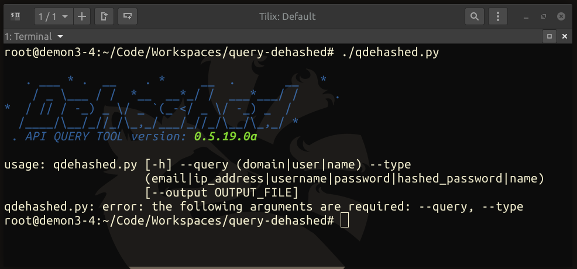

# q-dehashed
Unofficial Dehashed.com API Query Tool

## INSTALLATION
Clone the repository:
```bash
git clone https://github.com/RackunSec/q-dehashed.git
```
Install the requirements:
```bash
cd q-dehashed
python3 -m pip install -r requirements.txt
```
Update the main app to include your email address and API token:
```python
16: full_query={
17:    "api_auth":("<EMAIL>","<API TOKEN>"),
```
## EXAMPLES
Run the application with your search type.
```bash
root@demon3-4:~/Code/Workspaces/query-dehashed# ./qdehashed.py --type email --query someone@example.com

   . ___ * .  __    . *     __  .       __   *
    / _ \___ / /  *__  __*_/ /  ___*___/ /     .
*  / // / -_) _ \/ _ `(_-</ _ \/ -_) _  /
  /____/\__/_//_/\_,_/___/_//_/\__/\_,_/ *
 . API QUERY TOOL version: 0.5.19.0a

 ✔  Dehashed API token balance: 56
 ✔  Total entries discovered: 1010
 ✔  API server sesponse time: 163µs

id,email,ip_address,username,password,hashed_password,name,vin,address,phone,database_name
... [REDACTED] ...
```
